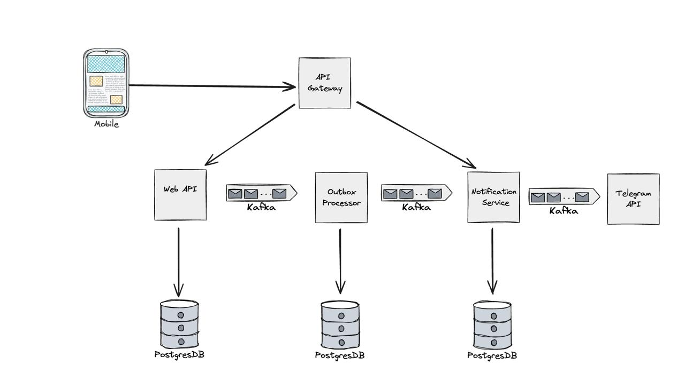

**NotifyHub** — Чат-бот-регламентатор для напоминаний

**NotifyHub** — это Telegram-чат-бот, разработанный в рамках производственной практики в компании **БАРС ГРУП**, предназначенный для своевременного напоминания пользователю о необходимости выполнения регламентных операций.

Возможности:  

- Создание и управление напоминаниями

- Поддержка периодических уведомлений (день/неделя/месяц)

- Асинхронная обработка задач с использованием Kafka

- Масштабируемая микросервисная архитектура:

    - Web API для управления уведомлениями

    - Notification Service для отправки

    - Outbox Processor для планирования и очередей

    - API Gateway для маршрутизации

    - Telegram Bot в роли клиента

Технологии:

- .NET 8

- PostgreSQL

- Apache Kafka

- Docker + Docker Compose

- GitHub Actions (CI/CD)

### Архитектура проекта



### Как запускать проект

Весь проект запускается с помощью `docker-compose`. 

Чтобы полностью пересобрать проект, можно воспользоваться командами: 

```shell
docker-compose down --rmi all -v
docker-compose up --build -d
```

также были добавлены сценарии для сборки через `Makefile`:

```shell
make docker
```

```shell
make docker-rebuild
```

После выполнения команд результат должен быть примерно таким: 


## API Gateway

Для запросов к микросервисам настроен `API Gateway` и доступен по адресу `http://localhost:8088`

Для плейграундов у микросервисов такие адреса: 

- graphql: `http://localhost:8088/graphql`

- swagger (notification service): `http://localhost:8088/swagger/index.html`