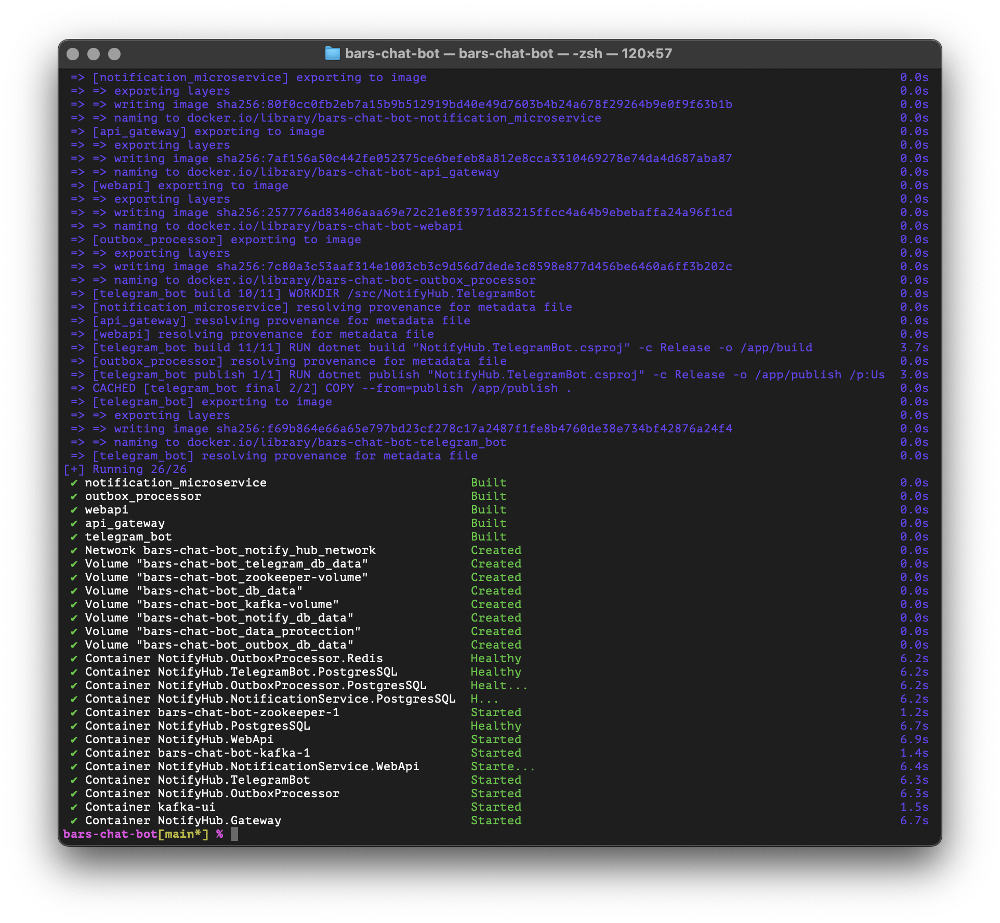

### Архитектура проекта


### Как запускать проект

Весь проект запускается с помощью `docker-compose`. 

Чтобы полностью пересобрать проект, можно воспользоваться командами: 

```shell
docker-compose down --rmi all -v
docker-compose up --build -d
```

также были добавлены сценарии для сборки через `Makefile`:

```shell
make docker
```

```shell
make docker-rebuild
```

После выполнения команд результат должен быть примерно таким: 

